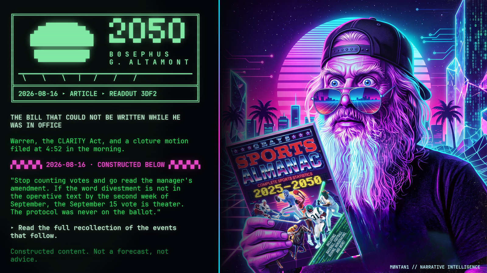
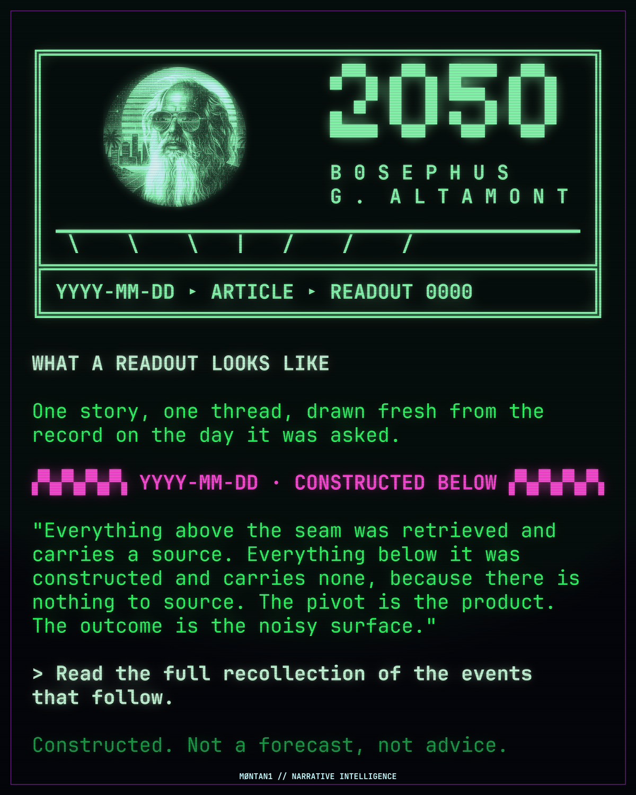
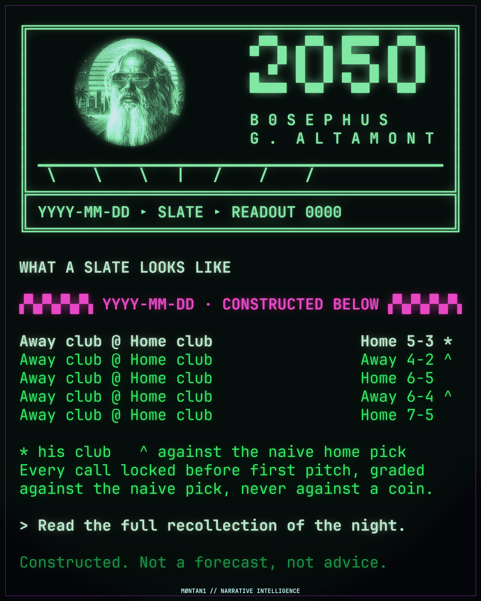
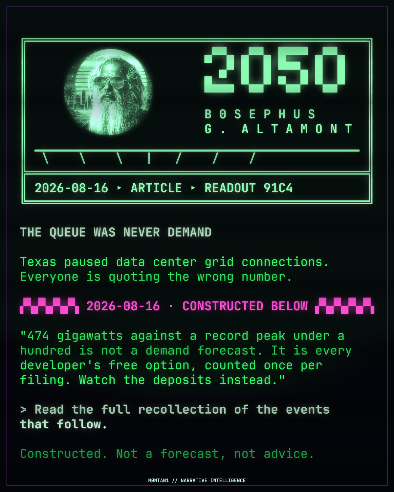

# MØNTAN1 Narrative Intelligence Engine
## Bosephus 2050



A **Narrative Intelligence engine** is not an agent, a bot, or a report generator.

It builds a narrative on top of a verified record, keeps a visible seam between the two halves, and leaves falsifiable markers behind so it can be graded later.

That distinction is the product. It is also the whole compliance posture. Call the thing an agent and a reader will take its output as a forecast, which is the one thing it must never be.

This repo is **Bosephus 2050**, the first engine built on the pattern. One repo per engine, sharing the `m0ntan1-narrative-intelligence-engine-*` prefix.

---

## The seven load-bearing parts

A spec missing any of these is not an engine. It is a prompt with good prose.

| # | Part | Why it is load-bearing |
|---|---|---|
| 1 | **A fixed vantage point**, used as the reasoning device | The voice *is* the method. He writes from 2050, so the years between are settled history he recounts, not a future he guesses at |
| 2 | **A hard dated seam** between retrieved and constructed | Rendered as an object, not left as a promise. A reviewer checks it at a glance |
| 3 | **Persistent identity, not a persistent timeline** | Who he is never moves. What he recalls is redrawn every run |
| 4 | **Falsifiable markers** in a ledger | The part everyone skips, because it is the only part that can make the engine look bad later |
| 5 | **A fixed output schema** | Stops the voice wandering into fiction with no analytic spine |
| 6 | **Frozen art and a required card** | Markdown does not survive a paste into a chat client. The card is the only form that travels |
| 7 | **A refusal posture** | Constructed content is never dressed as forecast or advice |

Full treatment in **[SPEC.md](SPEC.md)**.

---

## The seam

Between the cited half and the constructed half of every readout sits a dated rule.


Above it, retrieved, with a source. Below it, constructed, with none, because there is nothing to source.

The rule is mandatory. No cited claim may appear beneath it. Its absence is a failed artifact, not a style lapse.

Recall is implemented as **retrieval, never as memory**. The engine's past is accurate because it looks things up.

---

## The photograph

*Back to the Future* has a photograph the hero carries in his pocket. His brother and sister fade out of it as the past changes around them, and fade back in once it is repaired. The picture is not a record. It is a live readout of a future still being decided.

That is the model here, and it replaced a worse one.

An early draft kept a **Canon file**: settled beats every run had to honour, so the constructed future stayed consistent across artifacts. That was a mistake. Canon made every artifact a hostage to every other one. A single beat contradicted by reality poisons everything downstream that honoured it, and the damage compounds with every run.

So the world is re-instantiated at query time. Every run retrieves the record as it stands that day and builds forward from that alone. A later recollection that differs from an earlier one is not an error to suppress. **The negative has not fixed.** People at the edges of the frame come and go depending on what happened last week, and the thing in the middle of the frame does not move.

What stays invariant is **identity, not timeline**: the persona, and the locked constraints that are physics and arithmetic rather than construction.

Continuity moves from consistency with itself to consistency with reality, checked by a ledger. That is the only kind that can be graded.

Every artifact carries a `READOUT` identifier rather than a version number, because a version implies succession and readouts have none.

---

## The machine in the storage room


The engine explains itself in exactly one place, and it does it in character.

Bosephus at forty-one finds a machine under a tarp in the old boiler room that should not still power on. One folder on it he did not put there. It opens as garbage until he notices the garbage has structure: it does not want a viewer, it wants a terminal.

He keeps going back because the scores are the part it misses and **the turn is the part it gets**.

Two things it will not discuss: the price of anything, and his own life. Not because MØNTAN1 is not a registered adviser, though it is not. Because it has something behind it that it will not risk to win an argument.

Every guardrail in this repo is that refusal wearing a different hat. It is also why the cards look the way they do: the phosphor and the block masthead are a rendering of a real object in the story, not a style choice.

**[Read it in full](FRAME.md)** — about four minutes, and the shortest way to understand why the rest of this is shaped the way it is.

<br clear="all">

---

## Success is the pivot, not the outcome

This engine gets outcomes wrong, routinely. That is neither hidden nor excused.

What it is for is naming the hinge: **the catalyst, dated, specific enough that a reader could go and stand where it happens and watch it fire.**

Anyone can post a score. Almost nobody publishes a dated catalyst in advance and then shows whether it fired.

| Claim | Graded | Published |
|---|---|---|
| Did the named catalyst occur, by its date? | Binary, mechanical | **Headline** |
| Was it load-bearing? | Judged, standard fixed in advance | Internal |
| The outcome or score | Mechanical | Secondary line |

---

## What a readout looks like

| Article | Slate |
|---|---|
|  |  |
| One story. Masthead, headline, seam, pull quote, door. | A group of calls, all on one card. |

Wide 1600x900 for link unfurls, with a data panel built from the readout's own cited numbers:



Real examples with their full write-ups are in **[examples/](examples/)**.

---

## Quickstart

Needs Python 3, Pillow, and a monospace font with half-block glyph coverage. JetBrains Mono Nerd Font is the reference; many faces lack `▀ ▄ █ ▞ ▚ ▁` and render tofu.

```bash
pip install pillow
python3 engine/render_card.py engine/cards/2026-08-16_ercot-pause.card.json out.png
```

| Renderer | Output |
|---|---|
| `render_card.py` | 1200x1500 article card |
| `render_slate.py` | 1200x1500 slate, a group of calls |
| `render_wide.py` | 1600x900 with a data panel, for unfurls |
| `render_hero.py` | 1600x900 brand card with the character plate |
| `render_ansi.py` | Discord ANSI block, seam forced to neon pink |
| `render_seam.py` | Seam as a PNG, for surfaces that cannot colour text |

Two rules the renderers enforce rather than suggest: **copy is never hand-wrapped**, and **type size is never a choice**. If a renderer refuses, the fix is shorter copy. `engine/test_renderers.py` guards both, plus truncation, panel overflow and missing attribution.

Full conventions in **[SPEC.md](SPEC.md)**.

---

## SPORTS LOGIC

A policy marker resolves in months. A ballgame resolves in three hours.

That is why sports is here. It is the only place this engine generates honest forward calibration at any speed, and it is the proving ground that earns the right to be believed on the serious work.

```bash
python3 engine/sports/gamefile.py mlb --date 2026-08-16    # list games
python3 engine/sports/gamefile.py mlb --game 823344        # verified dossier
python3 engine/sports/grade.py  mlb --game 823344 --call "Red Sox 5, Pirates 3"
```

The weather discipline is the part worth stealing. Roof type comes from the venue record, never from anyone's memory of the ballpark:

| Roof | Behaviour |
|---|---|
| Dome | Weather never fetched, **block does not render** |
| Retractable | Fetched, flagged unknown unless actually reported |
| Open | Fetched, and the block **must name a mechanism or get cut** |
| No forecast | Fails silently. NWS covers the US only |

Grading is objective only, and always against the naive pick. A hit rate with no baseline is a number that sounds like something and means nothing.

Detail in **[SPEC.md](SPEC.md)**. Open calls in **[tells-sports.md](engine/sports/tells-sports.md)**.

---

## Layout

```
SPEC.md                  The spec, including the system prompt
FRAME.md                 The story, in character
engine/
  masthead.txt           Frozen art: 64 col, 48 col chat, 7-bit ASCII
  persona.md             Invariant identity
  locked-calendar.md     Invariant constraints: physics and arithmetic
  render_*.py            Six renderers
  test_renderers.py      Guards silent truncation, shrink and overflow
  cards/                 Card copy, one JSON per readout
  sports/                SPORTS LOGIC tooling and the calibration record
examples/                Complete readouts with their cards
docs/                    The Pages site
```

---

## What this is honest about

- **It is not a forecaster.** Every readout says so in its own footer.
- **Backtests validate the harness, not the forecaster.** A constructor writing a 2015 branch already knows about the pandemic. Run 01 scored the machinery at 78.8%; its 73.5% reality match is not a hit rate and is not published as one.
- **Weight bands, never percentages.** Load-bearing, live, or tail. A decimal makes a narrative artifact look like model output.
- **Boring is allowed and periodically required.** Most decades are mostly continuity. If every beat is a discontinuity, the artifact is fiction.

---

## Rights

**Code is Apache 2.0.** Use it, build on it, ship it commercially. Keep the `NOTICE` file with it, which is how credit travels.

**The brand and the content are not.** Reserved in full by MØNTAN1 LLC: the B0SEPHUS G. ALTAMONT persona, the specification and documentation prose, all artwork, and the marks MØNTAN1, MONTANI and B0SEPHUS.

Apache 2.0 section 6 grants no trademark rights, which is deliberate. Build your own engine with these tools and give it your own name.

Built in West Virginia. Educate. Disintermediate. Innovate. Build.
